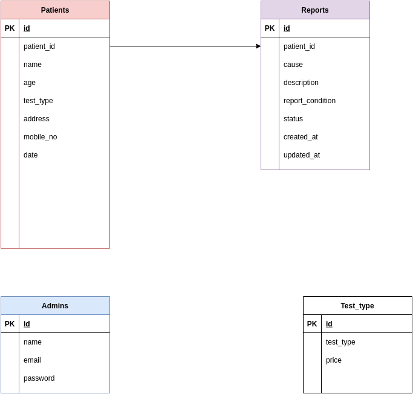
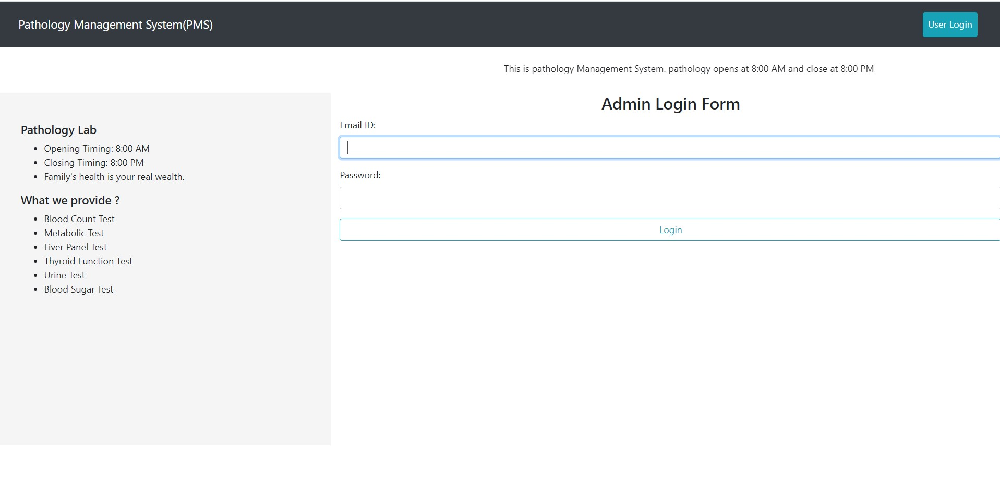
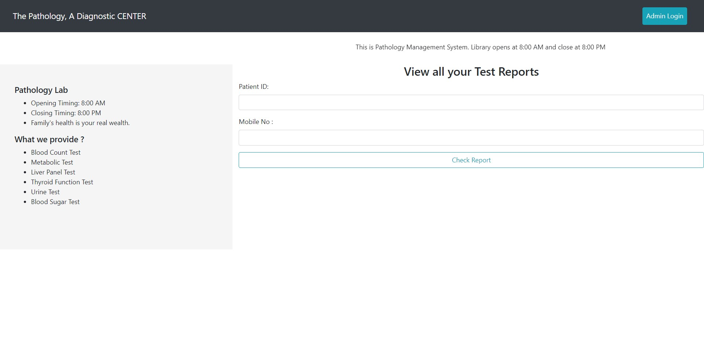
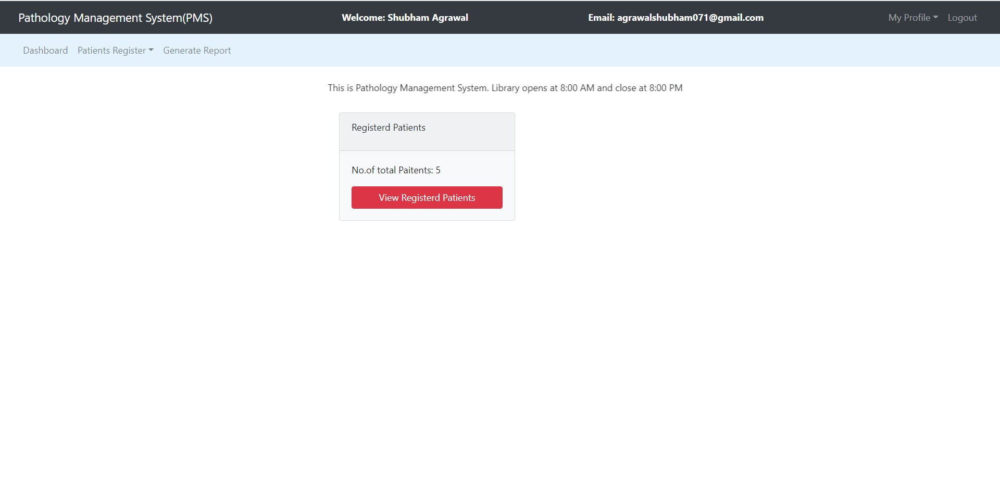
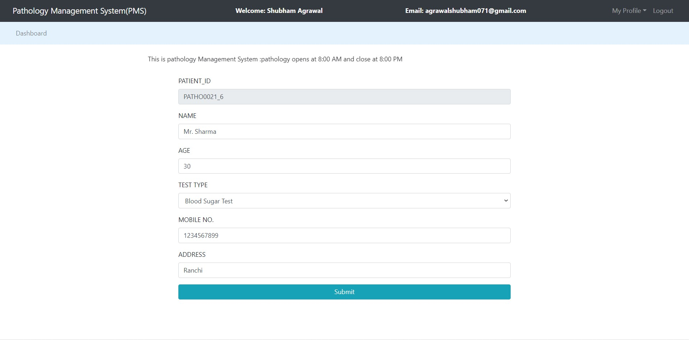
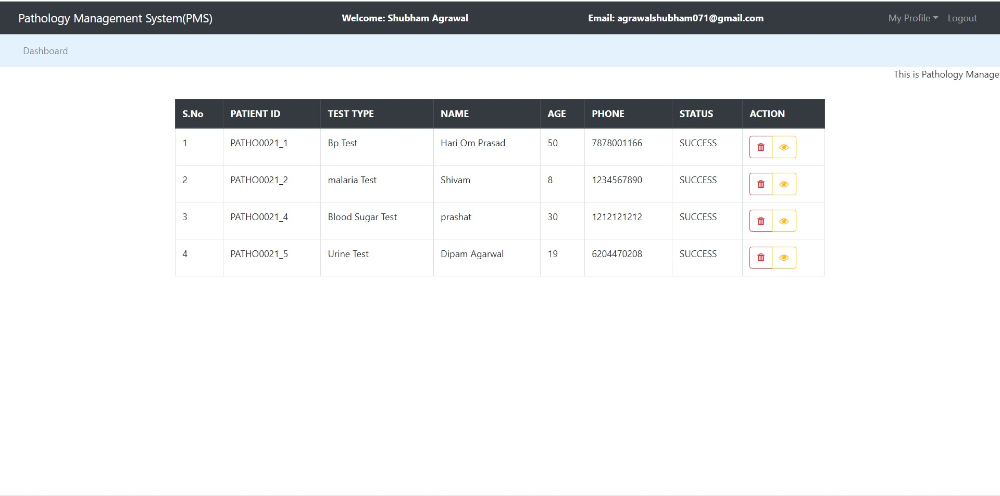
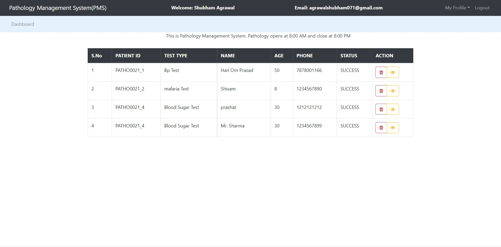
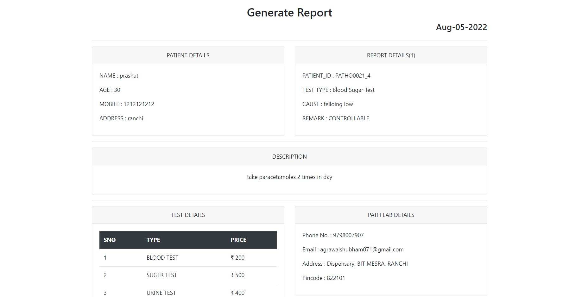
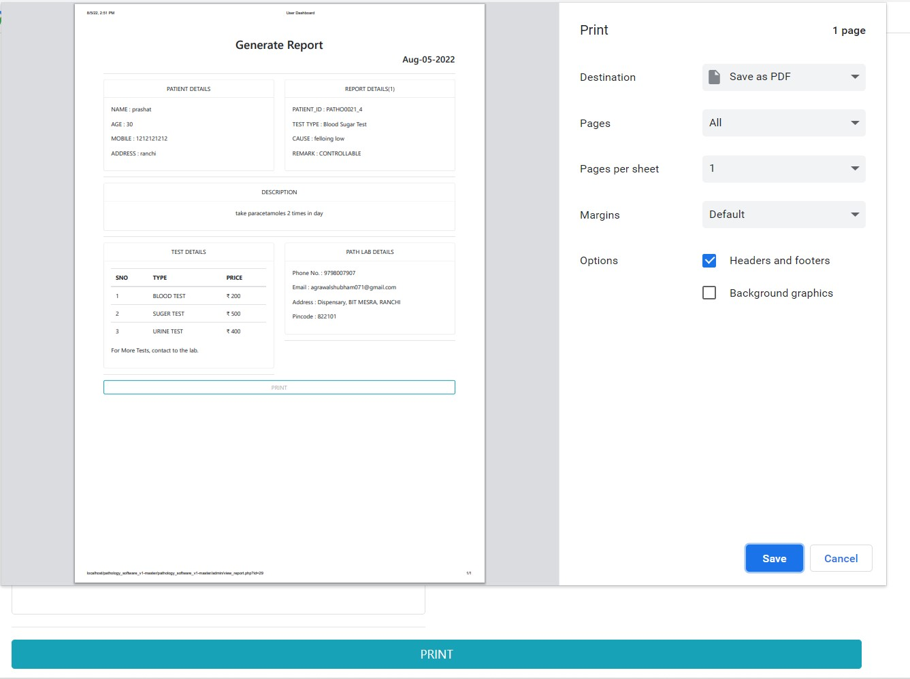

# Objective
<!-- # this unix code soln  here  -->
 My Objective behind this application is to make the process easy for laboratories and hospitals settings to manage the flow of patient and specimen information. The Features that I have given are- Admin login, Add Patient (in Add patient I have generated a unique Id for each patient), Manage Patients, Generate Reports, *user Side: On the user Side, the User can log in With report Id and mobile no, and there the user can able to see the status of the report either it is pending or successful from their success report, users can print.

# Technologies Used
* Frontend: HTML, CSS, Boostrap 4,javascript
* Backend: PHP,
# DATABASE DESIGN

<!-- # viedo of working features 
 -->

# Snapshots
welcome Page

Admin login

Patient login

Dashboard page

patient Register

Mangage Patient

View or Generate report

Click print

